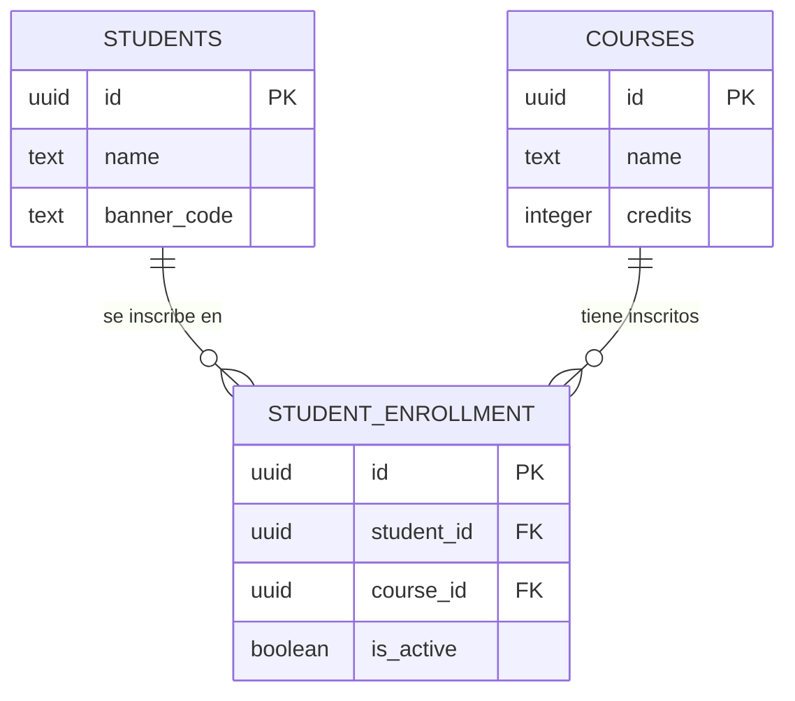

# Midterm 1 — Feature University

## Descripción

Esta feature expone un pequeño sistema universitario con tres entidades: `students`, `courses` y `student_enrollment` (la relación de inscripción entre un estudiante y un curso). La capa de base de datos ya está lista (esquema + datos semilla), al igual que las capas de `router`, `controller` y `service`. **Cuatro funciones de la capa de `repository` (`src/features/university/university.repository.ts`) están incompletas** y lanzan `Not implemented`: `getStudentByIdRepository`, `getCourseByIdRepository`, `getStudentEnrollmentsRepository` y `getEnrollmentRepository`. El resto del repositorio ya está resuelto.

## Diagrama de la base de datos



## Endpoints disponibles

- `GET /api/university/students/:studentId/enrollments`
- `POST /api/university/courses/:courseId/students/:studentId` (`enrollStudentController`) — inscribe al estudiante en el curso
- `PATCH /api/university/courses/:courseId/students/:studentId` (`updateEnrollmentStatusController`) — actualiza el estado de la inscripción según el `isActive` recibido en el body (`{ "isActive": false }`); el controller valida que `isActive` venga en el body y sea un booleano, respondiendo **400 Bad Request** si falta o si no es un booleano

Cada controller delega en su propio service: `enrollStudentController` llama a `enrollStudentService`, y `updateEnrollmentStatusController` llama a `updateEnrollmentStatusService` pasándole el `isActive` recibido en el body.

## Objetivos del examen

### 1. Implementar las funciones de búsqueda por id

Completa `getStudentByIdRepository` y `getCourseByIdRepository` en `university.repository.ts`. Ambas son consultas simples por `id`, y son las que usan los `service` para validar que el estudiante/curso exista antes de inscribir, consultar o dar de baja.

### 2. Devolver el detalle completo de las inscripciones de un estudiante

En `GET /api/university/students/:studentId/enrollments`, la respuesta debe incluir el detalle de cada inscripción (no solo los ids), usando la interfaz `EnrollmentDetails` de `university.types.ts`: nombre del estudiante, nombre y créditos del curso, y si la inscripción está activa. Implementa `getStudentEnrollmentsRepository` haciendo un `JOIN` entre `student_enrollment`, `students` y `courses`.

### 3. Implementar `getEnrollmentRepository` y validar el estado de la inscripción

Completa `getEnrollmentRepository`, que busca la inscripción (activa o no) de un estudiante en un curso. Cada vez que uno usuario desee actualizar el status de un enrollement, usted deberá implementar las siguientes reglas de negocio:

- Si se pide `isActive: true` y la inscripción ya está activa, responde **409 Conflict** con `"The user is already enrolled in that course"`.
- Si se pide `isActive: false` y la inscripción ya está inactiva, responde **409 Conflict** con `"The user is not enrolled in that course"`.

Recuerda mapear las columnas `snake_case` de la base de datos (`banner_code`, `student_id`, `course_id`, `is_active`) a los campos `camelCase` que definen las interfaces en `university.types.ts` (`bannerCode`, `studentId`, `courseId`, `isActive`), usando alias SQL (`AS "campoEnCamelCase"`).

## Cómo probar tu implementación

```bash
npm run dev
```

El servidor corre en `http://localhost:3000` y crea automáticamente la base de datos local (PGlite) en `./data/db`, con datos semilla: 5 cursos, 10 estudiantes y 20 inscripciones.
